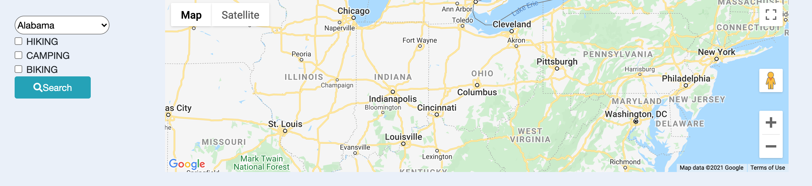
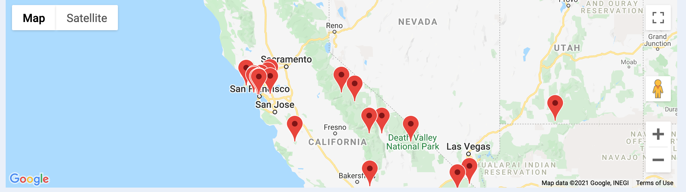
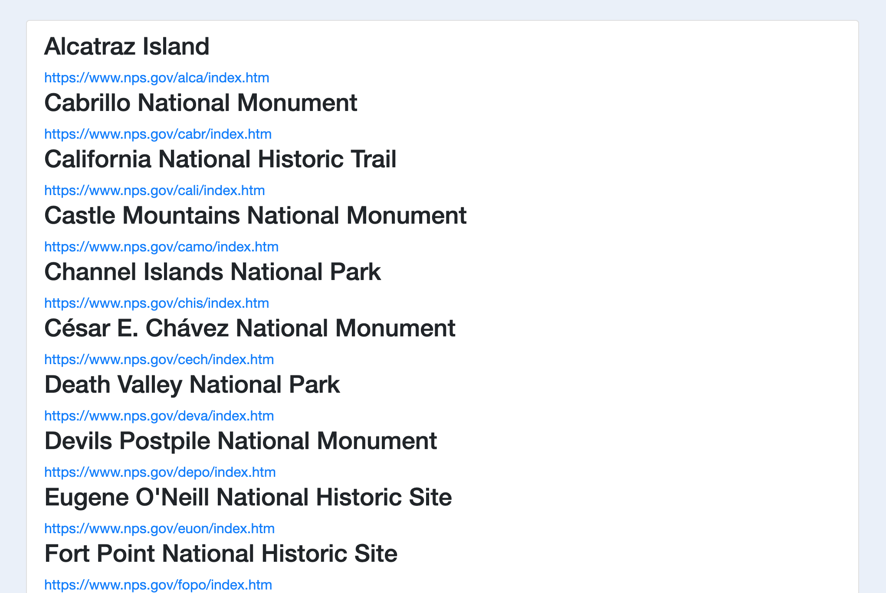
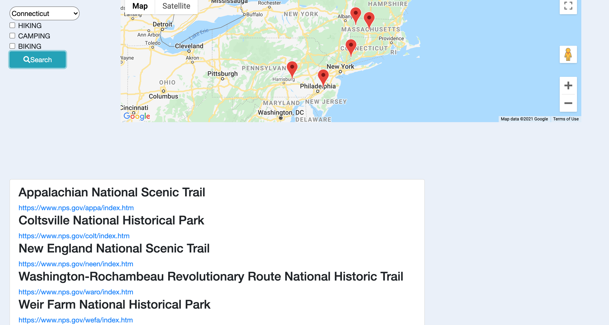

NPSDashboard
This is a web app for searching open National Parks with a State filter.

#User Story When a user wants to find an open national park that is withing a certain state they can navigate to this web page: https://wrmanns.github.io/NPS-Search-Engine/

#Functionality A user will be able to filter locations by state using this sidebar 

The map will center on the results

A list will populate with selectable links to each park

Upon selecting a new state the list will clear and repopulate with the new results & clear all markers and reset center on the new locations

All code can be accessed at: https://github.com/WRManns/NPS-Search-Engine